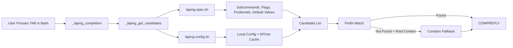
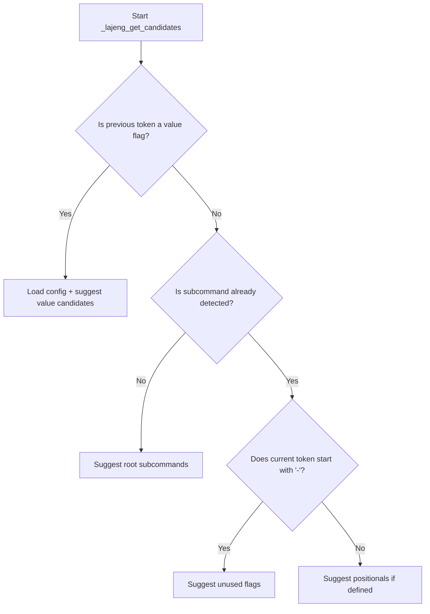

# `bash-completion-lajeng` Project Visuals

## Component Architecture

## Completion Decision Flow

## File Responsibility Mapping

- `lajeng-completion.sh`: completion routing and matching engine (`prefix first`, controlled fallback).
- `lajeng-spec.sh`: static CLI grammar (subcommands, flags, positionals, value flags).
- `lajeng-config.sh`: user config parser + default fallback + cache.
- `install.sh` / `uninstall.sh`: add and remove source line in `~/.bashrc`.
- `test/run-tests.sh`: regression guard for UX and correctness.
